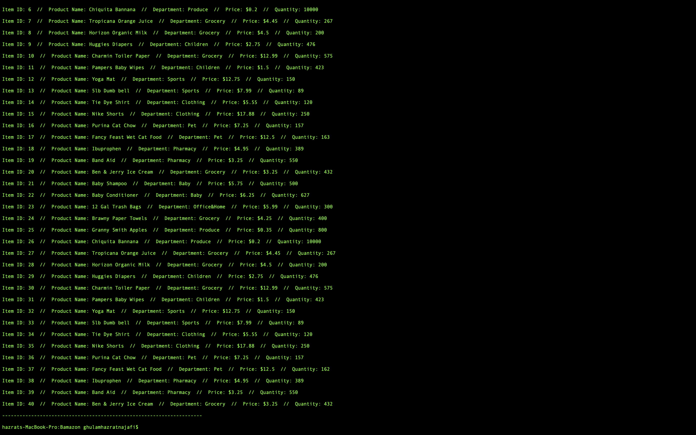

# Bamazon

Bamazon Description: This application implements a simple command line MySQL Database Setup In order to run this application, you should have the MySQL database already set up on your machine. If you don't, visit the MySQL installation page to install the version you need for your operating system. Once you have MySQL isntalled, you will be able to create the Bamazon database and the products table with the SQL code found in Bamazon.sql. Run this code inside your MySQL client like Sequel Pro to populate the database, then you will be ready to proceed with running the Bamazon customer and manager interfaces.

